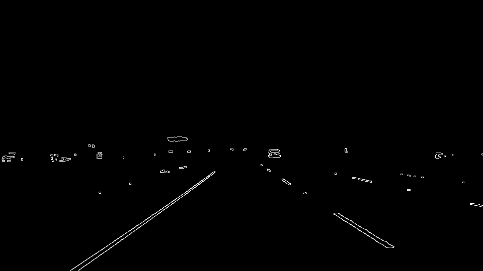

# **Finding Lane Lines on the Road** 

Overview
---

In this project I wrote a pipeline to detect lane lines in images, and then used it to process videos.

The Pipeline
---
My pipeline consisted of 6 steps.

1. I made a copy of the image and applied a color mask to isolate white and yellow object  

2. I converted the image to grayscale,

3. I applied Gaussian smoothing to suppress noise and spurious gradients and used a canny function to detect edges.

4. I applied a mask to isolate the lane line segments. 

5. I created a blank image and drew the lane line segements on the blank image. 

6. I put the lane line image and the orginal image together.

