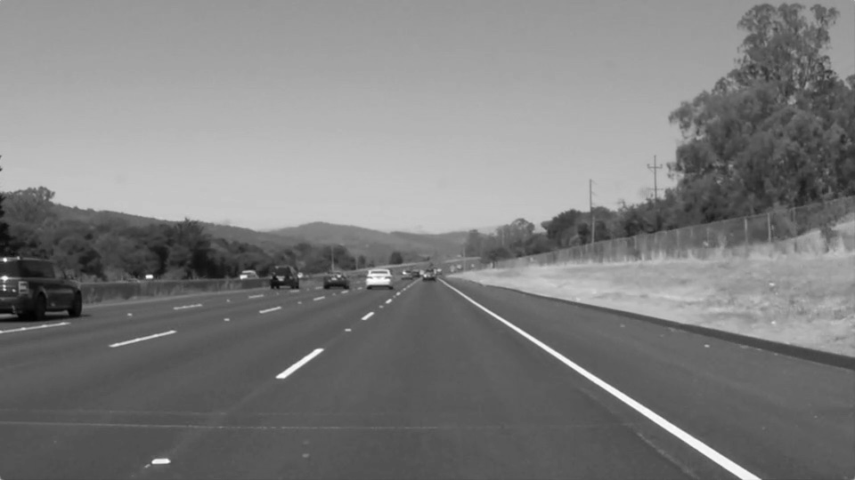

# **Finding Lane Lines on the Road** 

[//]: # (Image References)

[image1]: ./test_images/solidWhiteRight.jpg "Grayscale"
[image2]: ./test_images/grayscale.jpg "Grayscale"

---

### Reflection

### 1. Construct the pipeline.

My pipeline consisted of 6 steps. First, I made a copy of the image and converted the copy to grayscale,

then I applied Gaussian smoothing to suppress noise and spurious gradients in the grayscaled image. After that, I used a canny function from the OpenCV libraries to detect edges in the Gaussian-smoothed image. Next, I applied a mask to isolate the lane line segments. After that, I created a blank image and drew the lane line segements on the blank image. At last, we put the lane line image and the orginal image together 

In order to draw a single line on the left and right lanes, I modified the draw_lines() function by ...

If you'd like to include images to show how the pipeline works, here is how to include an image: 

![alt text][image2]

### 2. Identify potential shortcomings with your current pipeline

One potential shortcoming would be what would happen when ... 

Another shortcoming could be ...

### 3. Suggest possible improvements to your pipeline

A possible improvement would be to ...

Another potential improvement could be to ...
