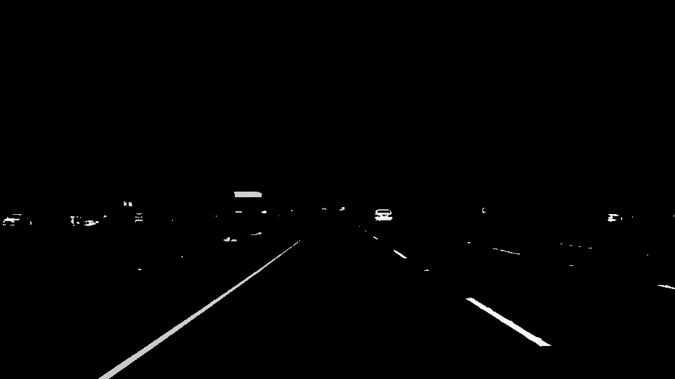

# **Finding Lane Lines on the Road** 

[//]: # (Image References)

---

### Reflection

### 1. Construct the pipeline.

My pipeline consisted of 6 steps. 

1. I made a copy of the image and applied a color mask to isolate white and yellow object  

2. I converted the image to grayscale,

3. I applied Gaussian smoothing to suppress noise and spurious gradients and used a canny function to detect edges.

4. I applied a mask to isolate the lane line segments. 

5. I created a blank image and drew the lane line segements on the blank image. 

6. I put the lane line image and the orginal image together.

In order to draw a single line on the left and right lanes, I modified the draw_lines() function. First, I identified the line segments on the left or right line by using the slopes of the line segments (the line segments with small slopes were filtered out). Then I fitted the left and right lines using linear functions. At last, I specify the two endpoints for each line to draw the left and right lines on the blank image

### 2. Potential shortcomings with the current pipeline

One potential shortcoming would be what would happen when there were two lines on one side

Another shortcoming could be what would happen when the car was changing lanes

### 3. Possible improvements to the pipeline

A possible improvement would be to identify line colors

Another potential improvement could be to identify whether the line is segmented or not
